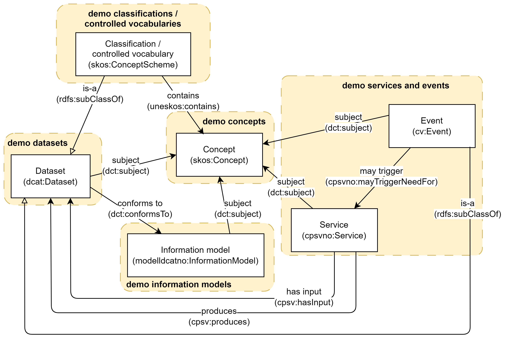

== Overview and cross-references between the showrooms [[overview]]

*Disclaimer*: The demo resources made available from the various showrooms are meant for demo purposes only.  

The main purpose of the showrooms is to demonstrate 

* how to use the various RDF-based Norwegian national specifications to make available  machine-readable resources in accordance with the specifications, 
* how to cross-reference/link between the resources across the specifications.  

<> illustrates some of the cross-references between the resource types that are demonstrated in the showrooms. 

[[img-overiew]]
.Overview and cross-references between the resource types that are demonstrated in the showrooms.
[link=images/crossreferencing-between-showrooms.png]

_#... more to come ...#_ 

