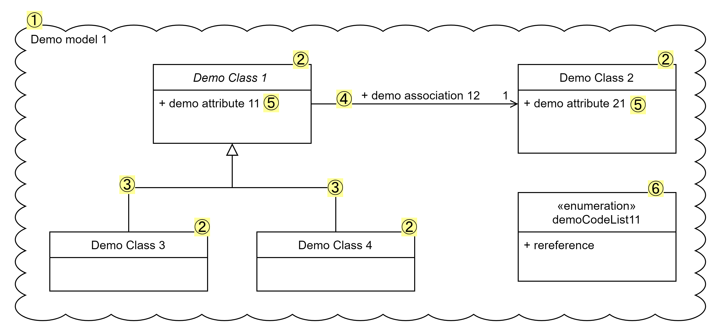

include::../locale/attributes.adoc[]
= image:../images/Digdir.png[Digdir,200,200] showroom - demo information models
Norwegian Digitalisation Agency (Digdir)
:doctype: book
:docinfo: shared
:docinfodir: ../docs
:icons: font
:toc: left
ifdef::backend-pdf[:toc: macro]
:toc-title: Content
:toclevels: 4
// :sectlinks:
:sectanchors:
:table-stripes: even
:xrefstyle: short

Welcome to the showroom with demo information models, demonstrating the usage of ModellDCAT-AP-NO! 

_https://data.norge.no/specification/modelldcat-ap-no[ModellDCAT-AP-NO ↗, window="_blank", role="ext-link"] (in Norwegian only) is the Norwegian application profile of https://data.norge.no/specification/dcat-ap-no[DCAT-AP-NO ↗, window="_blank", role="ext-link"], for describing information models and catalogs of information models._

== Purpose [[purpose]]

This showroom is meant to

* demonstrate how to describe an information model in accordance with ModellDCAT-AP-NO;
* demonstrate how to describe relations between information models, in accordance with ModellDCAT-AP-NO;
* demonstrate cross-references between information models and some other resources demonstrated in some of the other showrooms;
* provide reusable, machine-readable RDF-based model descriptions, for testing and demonstration purposes.
 
*_Disclaimer_*: _The machine-readable demo information models are meant for demo purposes only. They do not represent any real world fenomena at all. On the other hand, they are supposed to syntactically conform to ModellDCAT-AP-NO._

== Demo resources in this showroom [[demo-resources]]

In this showroom we have a https://w3id.org/demo-resources/demo-models[a catalog with several demo information models] (in link:files/demo-models.ttl[RDF Turtle]):

* The demo information models are automatically harvested to and thus findable via https://demo.fellesdatakatalog.digdir.no/informationmodels?q=demomodel[the demo portal ↗, window="_blank", role="ext-link"]. #Note: the demo portal has some bugs such that not all properties are currently shown in the portal.# 

* There are four demo information models: 
** https://w3id.org/demo-resources/demo-models#demomodel1["Demo model 1"] contains https://w3id.org/demo-resources/demo-models#demomodel2["Demo model 2"] and https://w3id.org/demo-resources/demo-models#demomodel3["Demo model 3"], and https://w3id.org/demo-resources/demo-models#demomodel4["Demo model 4"] illustrates the usage of all _syntactically_ possible relations that an information model may have with other information models, in accordance with ModellDCAT-AP-NO. 
** All four demo models have graphical representations, which are referred to from the description.
** Except for "Demo model 1", the other three demo models are described only at the model level, i.e., without descriptions of the model elements in the models, in compliance with ModellDCAT-AP-NO. 
*** Simply put: you don't need to describe all the details in your information model, before you can tell the world that you have an information model. 

* "Demo model 1" also illustrates in particular the following: 
** "Demo model 1" has four https://data.norge.no/specification/modelldcat-ap-no#klasse-modellelement[model elements ↗, window="_blank", role="ext-link"], which are https://data.norge.no/specification/modelldcat-ap-no#klasse-objekttype[object types ↗, window="_blank", role="ext-link"] (classes in UML): https://w3id.org/demo-resources/demo-models#demoObjType1["Demo Class 1"], https://w3id.org/demo-resources/demo-models#demoObjType2["Demo Class 2"], https://w3id.org/demo-resources/demo-models#demoObjType3["Demo Class 3"] and https://w3id.org/demo-resources/demo-models#demoObjType4["Demo Class 4"]. 
** "Demo Class 1" has an association (in UML) to "Demo Class 2", which is a https://data.norge.no/specification/modelldcat-ap-no#Rolle-egenskaper[role ↗, window="_blank", role="ext-link"] in ModellDCAT-AP-NO.
** "Demo Class 3" and "Demo Class 4" are subclasses of "Demo Class 1", described as https://data.norge.no/specification/modelldcat-ap-no#Spesialisering-egenskaper[specializations ↗, window="_blank", role="ext-link"] in ModellDCAT-AP-NO.  
** "Demo Class 1" has an https://data.norge.no/specification/modelldcat-ap-no#Attributt-egenskaper[attribute  ↗, window="_blank", role="ext-link"] named https://w3id.org/demo-resources/demo-models#demoAttribute11["demo attribute 11"]. 
*** This attribute uses a code list as its value range.
*** The code list, https://jimjyang.github.io/showroom/modelldcat-ap-no/files/demo-models-nb#demoCodelist11["Demo Code List 1"], is our "Demo classification 1" demonstrated in our link:../xkos-ap-no[showroom with demo classifications].

.Click for mapping to ModellDCAT-AP-NO.
[%collapsible]
====
."Demo modell 1". 
[[img-demomodel1-mapping2modelldcatno]]
[link=images/demomodel1-mapping-examples.png]

The UML-elements in "Demo model 1" shown in <> are mapped to ModellDCAT-AP-NO as shown in <<table-demomodel1-mapping2modelldcatno>>. 

[[table-demomodel1-mapping2modelldcatno]]
.Mapping of "Demo model 1" to ModellDCAT-AP-NO.
[cols="20,20,60"]
|====
| *Element (number)* | *UML* | *ModellDCAT-AP-NO*
| 1 | | Information model (modelldcatno:InformationModel)
| 2 | Class | Object type (modelldcatno:ObjectType)
| 3 | Generalization | Specialization (modelldcatno:Specialization) 
| 4 | Association | Role (modelldcatno:Role)
| 5 | Attribute | Attribute (modelldcatno:Attribute)
| 6 | Enumeration | Code list (modelldcatno:CodeList)
|====

====  

== Some cross-references with other demo resources [[cross-references]]

*_Note_*: _Not all possible cross-references are demonstrated in this showroom. The lists are thus not exhaustive._

*Information models and classifications*, for example: 

* When describing an information model, and where coded values are used, the coded values should preferably be chosen from controlled vocabularies (i.e., classifications). 
** Examples of properties with coded values are https://data.norge.no/specification/modelldcat-ap-no#Informasjonsmodell-modellstatus[status (adms:status) ↗,  window="_blank", role="ext-link"] and https://data.norge.no/specification/modelldcat-ap-no#Informasjonsmodell-type[type (dct:type) ↗,  window="_blank", role="ext-link"], which are demonstrated by e.g. https://w3id.org/demo-resources/demo-models#demomodel1["Demo model 1"]. 
** Classifications should therefore be made available, also machine-readably.

* An information model may use classifications (controlled vocabularies, code lists etc.) as "datatype/range specification" for its "attributes".
** This is demonstrated by "Demo model 1", where https://w3id.org/demo-resources/demo-models#demoAttribute11["demo attribute 11"] refers to (by using the property https://data.norge.no/specification/modelldcat-ap-no#Attributt-harVerdierFra[has value from (modelldcatno:hasValueFrom) ↗,  window="_blank", role="ext-link"]) a code list. The code list it refers to is our "Demo controlled vocabulary 1" which is demonstrated in our link:../xkos-ap-no[showroom with demo classifications]. 
** Classifications should therefore be made available, also machine-readably.

*Information models and concepts*, for example: 

* An information model may refer to concepts that the information model represents or concepts that are relevant for understanding the information model.
** This is demonstrated by "Demo model 1", where its https://w3id.org/demo-resources/demo-models#demoObjType1["Demo Class 1"] refers to (by using the property https://data.norge.no/specification/modelldcat-ap-no#Modellelement-begrep[subject (skos:Concept) ↗,  window="_blank", role="ext-link"]) our "demo concept 1" which is demonstrated in our link:../skos-ap-no[showroom with demo concepts]. 
** In general, an https://data.norge.no/specification/modelldcat-ap-no#Informasjonsmodell-egenskaper[information model ↗,  window="_blank", role="ext-link"] itself, its https://data.norge.no/specification/modelldcat-ap-no#Modellelement-egenskaper[model elements ↗,  window="_blank", role="ext-link"] (object types, code lists etc.) and https://data.norge.no/specification/modelldcat-ap-no#Egenskap-egenskaper[properties ↗,  window="_blank", role="ext-link"] (attributes, associations etc.) may all refer to concepts, using the property `subject (skos:Concept)` in accordance with ModellDCAT-AP-NO. 

*Information models and datasets*, for example: 

* A dataset (and/or its distributions, data services) may conform to one or more standards (incl. information models).
** This is demonstrated in our link:../dcat-ap-no[showroom with demo datasets]. 
** Information models should therefore be made available, also machine-readably.   

*Information models and services/events*, for example: 

* An evidence needed to execute a service, is a dataset and thus may conform to one or more standards (incl. information models).
** This is demonstrated in our link:../cpsv-ap-no[showroom with demo services and events]. 
** Information models should therefore be made available, also machine-readably.

== _to the overview of the showrooms_ [[to-overview]]

link:../#overview[Click here for the overview of all the showrooms]