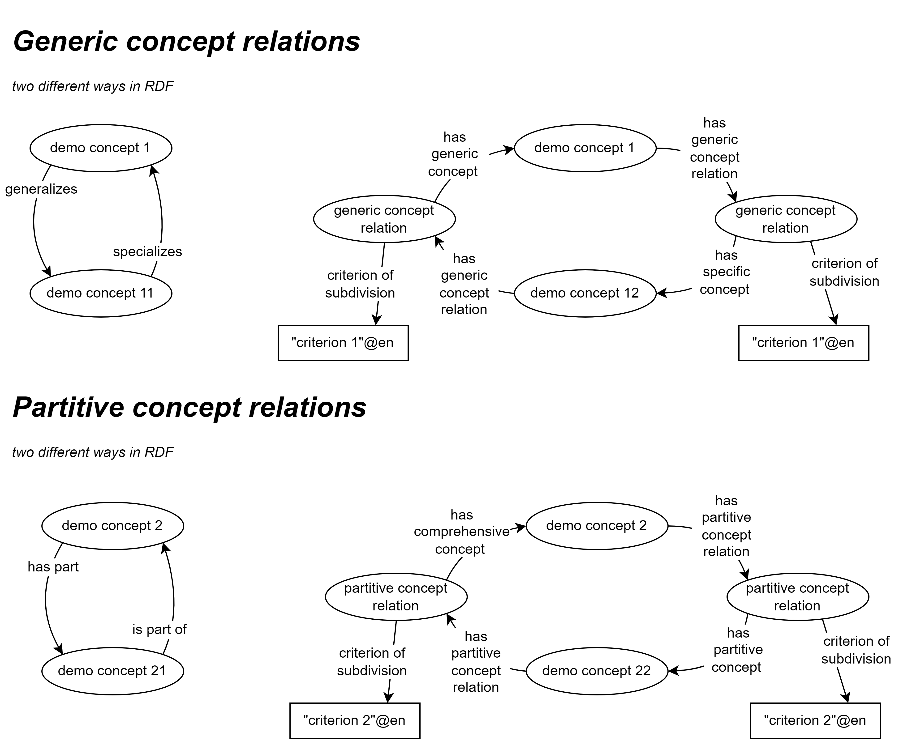

include::../locale/attributes.adoc[]
= Jim's showroom - demo concepts
:doctype: book
:docinfo: shared
:docinfodir: ../docs
:icons: font
:toc: left
ifdef::backend-pdf[:toc: macro]
:toc-title: Content
:toclevels: 4
// :sectlinks:
:sectanchors:
:table-stripes: even
:xrefstyle: short

Welcome to the showroom with demo concepts, demonstrating the usage of https://data.norge.no/specification/skos-ap-no-begrep[SKOS-AP-NO-Begrep ↗, window="_blank", role="ext-link"]! 

_SKOS-AP-NO is the Norwegian application profile of W3C's https://www.w3.org/2004/02/skos/[SKOS ↗, window="_blank", role="ext-link"], for describing and publishing concepts and concept collections._

== Purpose [[purpose]]

This showroom is meant to

* demonstrate machine-readable concept descriptions in accordance with SKOS-AP-NO-Begrep v.2.x;
* demonstrate in particular how to describe concept relations, in accordance with SKOS-AP-NO-Begrep v.2.x;
* demonstrate some cross-references between concepts and other resources demonstrated in some of the other showrooms;
* provide reusable, machine-readable concept descriptions, for testing and demonstration purposes.

*_Disclaimer_*: _The machine-readable demo concepts are meant for demo purposes only. They do not represent any real world concepts at all. On the other hand, they are supposed to syntactically conform to SKOS-AP-NO-Begrep v.2.x._ 

== Demo resources in this showroom [[demo-resources]]

In this showroom we have a https://w3id.org/demo-resources/demo-concepts[collection of demo concepts] (in link:files/demo-concepts.ttl[RDF Turtle]):

* The demo concepts #will be# automatically harvested to and thus also (#not yet#) be findable via https://demo.fellesdatakatalog.digdir.no/concepts?q=demoCpt[the demo portal ↗, window="_blank", role="ext-link"].
* There are seven https://data.norge.no/specification/skos-ap-no-begrep#Begrep[concepts ↗, window="_blank", role="ext-link"] in the https://data.norge.no/specification/skos-ap-no-begrep#Begrepssamling[collection ↗, window="_blank", role="ext-link"], where
** https://w3id.org/demo-resources/demo-concepts#demoCpt1["demo concept 1"] generalizes https://w3id.org/demo-resources/demo-concepts#demoCpt11["demo concept 11"] and https://w3id.org/demo-resources/demo-concepts#demoCpt12["demo concept 12"] (generic relations)
*** "demo concept 11" specializes "demo concept 1"
*** "demo concept 12" specializes "demo concept 1"
** https://w3id.org/demo-resources/demo-concepts#demoCpt2["demo concept 2"] contains https://w3id.org/demo-resources/demo-concepts#demoCpt21["demo concept 21"] and https://w3id.org/demo-resources/demo-concepts#demoCpt22["demo concept 22"] (partitive relations)
***  "demo concept 21" is part of  "demo concept 2"
***  "demo concept 22" is part of  "demo concept 2"
** https://w3id.org/demo-resources/demo-concepts#demoCpt3["demo concept 3"] illustrates the usage of all _syntactically_ possible relations that a concept may have with other concepts. 

=== About concept relations

==== Hierarchical concept relations [[hierarchical-relations]]

There are two types of hierarchical concept relations: generic and partitive. 

<> illustrates some of the hierarchically relations between the demo concepts that are in the above mentioned collection. 

[[img-hierarchical-relations]]
.Two ways to describe hierarchical relations. 
[link=images/hierarchical-relations-explanations.png]

The figure illustrates in particular the two different ways of describing hierarchical concept relations, in accordance with SKOS-AP-NO-Begrep v.2.x: 

* The straightforward way, when there is no need for specifying the criterion of subdivision: 
** by using the property https://data.norge.no/specification/skos-ap-no-begrep#Begrep-spesialiserer[specializes (xkos:specializes) ↗, window="_blank", role="ext-link"] or https://data.norge.no/specification/skos-ap-no-begrep#Begrep-generaliserer[generalizes (xkos:generalizes) ↗, window="_blank", role="ext-link"] for generic concept relations, demonstrated by the generic relations between https://w3id.org/demo-resources/demo-concepts#demoCpt1["demo concept 1"] and https://w3id.org/demo-resources/demo-concepts#demoCpt11["demo concept 11"]
** by using the property https://data.norge.no/specification/skos-ap-no-begrep#Begrep-inneholder[has part (xkos:hasPart) ↗, window="_blank", role="ext-link"] or https://data.norge.no/specification/skos-ap-no-begrep#Begrep-er-del-av[is part of (xkos:isPartOf) ↗, window="_blank", role="ext-link"] for partitive concept relations, demonstrated by the partitive relations between https://w3id.org/demo-resources/demo-concepts#demoCpt2["demo concept 2"] and https://w3id.org/demo-resources/demo-concepts#demoCpt21["demo concept 21"]

* Via an instance of generic/partitive concept relation, when there is a need for specifying the criterion of subdivision: 
** by using the property https://data.norge.no/specification/skos-ap-no-begrep#Begrep-har-generisk-begrepsrelasjon[has generic concept relation (skosno:hasGenericConceptRelation) ↗, window="_blank", role="ext-link"] for generic concept relations, demonstrated by the generic relations between https://w3id.org/demo-resources/demo-concepts#demoCpt1["demo concept 1"] and https://w3id.org/demo-resources/demo-concepts#demoCpt12["demo concept 12"]
** by using the property https://data.norge.no/specification/skos-ap-no-begrep#Begrep-har-partitiv-begrepsrelasjon[has partitive concept relation (skosno:hasPartitiveConceptRelation) ↗, window="_blank", role="ext-link"] for partitive concept relations, demonstrated by the partitive relations between https://w3id.org/demo-resources/demo-concepts#demoCpt2["demo concept 2"] and https://w3id.org/demo-resources/demo-concepts#demoCpt22["demo concept 22"] 
 
==== Associative concept relations [[associative-relations]]

While there are only two types of hierarchical concept relations as demonstrated above, there is an unlimited number of types of associative concept relations. 

In SKOS-AP-NO-Begrep, some types of associative relations are explicitly supported, demonstrated by https://w3id.org/demo-resources/demo-concepts#demoCpt3["demo concept 3"]:

* https://data.norge.no/specification/skos-ap-no-begrep#Begrep-erstatter[replaces (dct:replaces) ↗, window="_blank", role="ext-link"] / https://data.norge.no/specification/skos-ap-no-begrep#Begrep-er-erstattet-av[is replaced by (dct:isReplacedBy) ↗, window="_blank", role="ext-link"]
* https://data.norge.no/specification/skos-ap-no-begrep#Begrep-har-n%C3%A6rt-samsvar-med[has close match with (skos:closeMatch) ↗, window="_blank", role="ext-link"]
* https://data.norge.no/specification/skos-ap-no-begrep#Begrep-har-eksakt-samsvar-med[has exact match with (skos:exactMatch) ↗, window="_blank", role="ext-link"]
* https://data.norge.no/specification/skos-ap-no-begrep#Begrep-se-ogs%C3%A5[see also (rdfs:seeAlso) ↗, window="_blank", role="ext-link"]

SKOS-AP-NO-Begrep of course also allows you to specify your own types of associative concept relations, by using the property https://data.norge.no/specification/skos-ap-no-begrep#Begrep-er-fra-begrep-i[is from-concept in (skosno:isFromConceptIn) ↗, window="_blank", role="ext-link"] which refers to an instance of the class https://data.norge.no/specification/skos-ap-no-begrep#Assosiativ-begrepsrelasjon[Associative concept relation (skosno:AssociativeConceptRelation) ↗, window="_blank", role="ext-link"]. This is also demonstrated by https://w3id.org/demo-resources/demo-concepts#demoCpt3["demo concept 3"]. 

=== About concept definitions [[definition]]

There are also two different ways to specify the definition of a given concept: 

* The straightforward way, when there is no need for more details about the definition, by using the property https://data.norge.no/specification/skos-ap-no-begrep#Begrep-definisjon-direkte-angivelse[definition (direct statement) (skos:definition) ↗, window="_blank", role="ext-link"], demonstrated by e.g. https://w3id.org/demo-resources/demo-concepts#demoCpt1["demo concept 1"].
* Via an instance of the class https://data.norge.no/specification/skos-ap-no-begrep#Definisjon[Definition (euvoc:XlNote) ↗, window="_blank", role="ext-link"] by using the property https://data.norge.no/specification/skos-ap-no-begrep#Begrep-definisjon-via-definisjonsobjekt[definition (via definition object) (euvoc:xlDefinition) ↗, window="_blank", role="ext-link"], when there is a need for more details about the definition. This is demonstrated by https://w3id.org/demo-resources/demo-concepts#demoCpt2["demo concept 2"], where details about the source and the audience of the definition are given. 

== Some cross-references with other demo resources [[cross-references]]

*_Note_*: _Not all possible cross-references are demonstrated in this showroom. The lists are thus not exhaustive._

*Concepts and classifications*, for example:

* A concept may refer to a classification as its value range. 
** Our https://w3id.org/demo-resources/demo-concepts#demoCpt2["demo concept 2"], refers to our https://w3id.org/demo-resources/demo-classifications#demoClassification1["demo controlled vocabulary 1"] (demonstrated in our https://jimjyang.github.io/showroom/xkos-ap-no/[showroom with demo classificatinos]) as its https://data.norge.no/specification/skos-ap-no-begrep#Begrep-verdiomr%C3%A5de[value range (skosno:valueRange) ↗, window="_blank", role="ext-link"].
* A concept may be included in or referred to from a classification. 
** This is demonstrated in our https://jimjyang.github.io/showroom/xkos-ap-no/[showroom with demo classifications]. 

*Concepts and datasets*, for example:

* A dataset may refer to concepts that the dataset represents or concepts that are relevant for understanding the dataset, by using the property https://data.norge.no/specification/dcat-ap-no#Datasett-begrep[concept (dct:subject) ↗, window="_blank", role="ext-link"]
** This will be demonstrated in our https://jimjyang.github.io/showroom/dcat-ap-no/[showroom with demo datasets].

* When describing a dataset, and where coded values are used, the coded values should preferably be concepts chosen from controlled vocabularies (i.e., classifications). Examples of properties with coded values are https://data.norge.no/specification/dcat-ap-no#Datasett-tilgangsniv%C3%A5[access rights (dct:accessRights) ↗,  window="_blank", role="ext-link"] and https://data.norge.no/specification/dcat-ap-no#Distribusjon-format[format (dct:format) ↗,  window="_blank", role="ext-link"]. 
** This will be demonstrated in our https://jimjyang.github.io/showroom/dcat-ap-no/[showroom with demo datasets].

*Concepts and information models*, for example:

* An information model may refer to concepts that the information model represents or concepts that are relevant for understanding the information model, by using the property https://data.norge.no/specification/modelldcat-ap-no#Egenskap-begrep[subject (dct:subject) ↗,  window="_blank", role="ext-link"].
** This will be demonstrated in our https://jimjyang.github.io/showroom/modelldcat-ap-no/[showroom with demo information models].

* When describing an information model, and where coded values are used, the coded values should preferably be concepts chosen from controlled vocabularies (i.e., classifications). Examples of properties with coded values are https://data.norge.no/specification/modelldcat-ap-no#Informasjonsmodell-modellstatus[status (adms:status) ↗,  window="_blank", role="ext-link"] and https://data.norge.no/specification/modelldcat-ap-no#Informasjonsmodell-type[type (dct:type) ↗,  window="_blank", role="ext-link"]. 
** This will be demonstrated and explained in our https://jimjyang.github.io/showroom/modelldcat-ap-no/[showroom with demo information models]. 

*Concepts and services/events*, for example:

* _#... more to come ...#_ 

== _to the overview of the showrooms_ [[to-overview]]

https://jimjyang.github.io/showroom/#overview[Click here for the overview of all the showrooms]