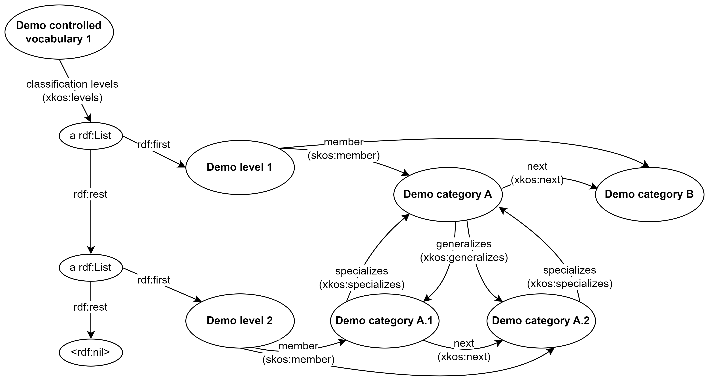

include::../locale/attributes.adoc[]
= Jim's showroom - demo classifications
:doctype: book
:docinfo:
:icons: font
:toc: left
ifdef::backend-pdf[:toc: macro]
:toc-title: Content
:toclevels: 4
// :sectlinks:
:sectanchors:
:table-stripes: even
:xrefstyle: short

Welcome to the showroom with demo classifications, demonstrating the usage of https://data.norge.no/specification/xkos-ap-no[XKOS-AP-NO, window="_blank", role="ext-link"]! 

XKOS-AP-NO is the Norwegian application profile of https://rdf-vocabulary.ddialliance.org/xkos.html[XKOS, window="_blank", role="ext-link"], for describing and publishing classifications, controlled vocabularies, code lists etc. 

== The purpose [[purpose]]

This showroom is meant to

* demonstrate machine-readable descriptions of classifications, classification levels and categories, in accordance with XKOS-AP-NO;
* demonstrate some cross-references between classifications and other resources demonstrated in some of the other showrooms;
* provided reusable, machine-readable classifications with  referenceable categories, for testing and demonstration purposes. 

*_Disclaimer_*: _The machine-readable demo classifications and demo categories are meant for demo purposes only. They do not represent any real world phenomena. On the other hand, they are supposed to syntactically conform to XKOS-AP-NO._

== The demo resources [[explanations]]

In this showroom we have a demo https://data.norge.no/specification/xkos-ap-no#Klassifikasjon[classification] with its https://data.norge.no/specification/xkos-ap-no#Klassifikasjonsniv%C3%A5[classification levels] and https://data.norge.no/specification/xkos-ap-no#Kategori[categories],  illustrated in <>. 

[[img-demo-classification]]
.Graphical illustration of the demo classification and its demo categories. 
[link=images/demo-classification1.png]

Our demo classification, called https://w3id.org/demo-resources/demo-classifications#demoClassification1["Demo controlled vocabulary 1"] (in link:files/demo-classifications.ttl[RDF Turtle]), has: 

* two classification levels, https://w3id.org/demo-resources/demo-classifications#demoLev1["Demo level 1"] and https://w3id.org/demo-resources/demo-classifications#demoLev2["Demo level 2"].
** "Demo level 1" contains categories https://w3id.org/demo-resources/demo-classifications#demo-category-A["Demo category A"] and https://w3id.org/demo-resources/demo-classifications#demo-category-B["Demo category B"].
** "Demo level 2" contains https://w3id.org/demo-resources/demo-classifications#demo-category-A1["Demo category A.1"] and https://w3id.org/demo-resources/demo-classifications#demo-category-A2["Demo category A.2"].
* "Demo category A" generalizes "Demo category A.1" and "Demo category A.2" .
** "Demo category A.1" specializes "Demo category A".
** "Demo category A.2" specializes "Demo category A".
* "Demo category A" should be presented before "Demo category B".
* "Demo category A.1" should be presented before "Demo category A.2".

== Some cross-references with other demo resources [[cross-references]]

*_Note_*: _Not all possible cross-references are demonstrated in this showroom. The lists are thus not exhaustive._

Classifications and concepts, for example: 

* A category in a classification is usually a concept. The definition of the concept should preferably be published outside and independently of the classification, although XKOS-AP-NO allows to define the concept as a part of the category description. 
** Our "Demo category A" represents, and thus also refers to (by  `dct:subject`), https://w3id.org/demo-resources/demo-concepts#demoCpt1["demo concept 1"] (demonstrated in our https://jimjyang.github.io/showroom/skos-ap-no/[showroom with demo concepts]). Similarly, "Demo category B" represents and refers to https://w3id.org/demo-resources/demo-concepts#demoCpt2["demo concept 2"], "Demo category A.1" represents and refers to https://w3id.org/demo-resources/demo-concepts#demoCpt11["demo concept 11"], and "Demo category A.2" represents and refers to https://w3id.org/demo-resources/demo-concepts#demoCpt12["demo concept 12"].
* A classification and its classification levels usually covers (exhaustively or not,  mutually exclusively or not) a set of concepts. 
** Our "Demo level 1", covers (`xkos:covers`) exhaustively (`xkos:coversExhaustively`) and mutually exclusively (`xkos:coversMutuallyExclusively`) "demo concept 1" and "demo concept 2". Similarly with our "Demo level 2" and "demo concept 11" and "demo concept 12". 

Classifications and datasets, for example:

* A classification with its categories is a dataset, and should be made available machine-readably. 
** In our https://jimjyang.github.io/showroom/dcat-ap-no/[showroom with demo datasets], we demonstrate how to describe this demo classification as a machine-readable open dataset, and to make it https://demo.fellesdatakatalog.digdir.no/datasets?q=demodataset[findable via the demo catalog].

* When describing a dataset, and where coded values are used, the coded values should preferably be chosen from controlled vocabularies (i.e., classifications). Examples of properties with coded values are "access rights" (`dct:accessRights`), "format" (`dct:format`). 
** This will be demonstrated and explained in our https://jimjyang.github.io/showroom/dcat-ap-no/[showroom with demo datasets]. 
** Classifications should therefore be made available, also machine-readably. 

Classifications and information models, for example:

* When describing an information model, and where coded values are used, the coded values should preferably be chosen from controlled vocabularies (i.e., classifications). Examples of properties with coded values are status (`adms:status`), type (`dct:type`). 
** This will be demonstrated and explained in our https://jimjyang.github.io/showroom/modelldcat-ap-no/[showroom with demo information models]. 
** Classifications should therefore be made available, also machine-readably. 

* An information model may use classifications (controlled vocabularies, code lists etc.) as "datatype/range specification" for its properties. 
** This is (currently unfortunately) not demonstrated in our https://jimjyang.github.io/showroom/modelldcat-ap-no/[showroom with demo information models], because our showcase there is currently only at the model level (i.e., without descriptions or its properties). 

  
Classifications and services/events, for example:

* When describing a service or event, and where coded values are used, the coded values should preferably be chosen from controlled vocabularies (i.e., classifications). 
** This will be demonstrated and explained in our https://jimjyang.github.io/showroom/cpsv-ap-no/[showroom with demo services and events]. 
** Classifications should therefore be made available, also machine-readably. 

== _to the overview of the showrooms_ [[to-overview]]

https://jimjyang.github.io/showroom/#overview[Click here for the overview of all the showrooms]